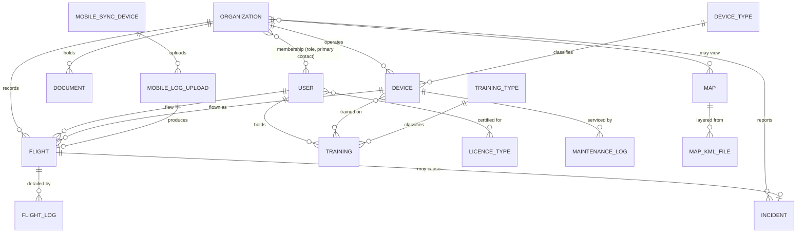

# 03 — Data model

Field names are **observed** where they came from a form binding (`data.x`,
`mountedTableActionsData.0.x`), a request payload key, or a JSON response key. Fields
marked *(inferred)* are deduced from column labels or framework convention and need
confirming against the database.

Types are the logical type. Constraints listed are those enforced client-side; server
rules are stricter and were not visible (see `00-index.md`).

## Entity relationship overview

---

## Organization

The tenant. Everything else hangs off it.

| Field | Type | Constraints | Notes |
|---|---|---|---|
| `id` | int PK | | |
| `name` | string(255) | **required** | |
| `logo_path` | string | PNG/JPG/WebP, ≤2 MB | Field name Observed on the form; stored `organization-logos/{ULID}.ext` |
| `uas_registration_number` | string(255) | | Operator registration, e.g. `SVK…` |
| `specific_permit_number` | string(255) | | SPECIFIC-category operating permit |
| `specific_operation_type` | enum | `VLOS` \| `BVLOS` | |
| `max_allowed_altitude` | decimal | | Metres |
| `insurance_valid_until` | date | | |
| `licence_expiry_warning_days` | int | **required**, 1–730, default 40 | Drives the amber expiry warning on the report |
| *report token* | string(32) hex | unique | Route key **and** operator-report URL. Column name not observed |

Counts shown in the admin table (`Používatelia`, `UAS`) are aggregates, not columns. There
is no `updated_at`: the register offers one as a toggleable column — Observed — but no
modification timestamp was ever seen in a payload, so the rebuild leaves the cell blank
rather than inventing a column to fill it.

### Organisation deletion and the logo in the rebuild — decided

A **decision about the rebuild**, taken on 15 Aug 2026 by the rebuild loop under the owner's
standing autonomy grant and recorded on issue #38. The owner has not reviewed it: settled
enough to build on, open enough to overturn.

**The logo is a path, not bytes.** `logo_path` holds where the file lives; the file lives on
disk. The form field name is Observed, and that it stores a path is *(inferred)* from the
observed `/storage/organization-logos/{ULID}.png` route — a column of bytes would not be
served from one. Keeping the bytes out of the row also keeps the register's own query small.
What serves that path is not decided here; nothing in the rebuild serves it yet.

**Deleting an organisation is blocked while dependents exist** — block rather than
soft-delete. The register offers the delete as a bulk action
([04-admin-resources.md](04-admin-resources.md) §OrganizationResource), which defers here
for which way it goes. An organisation owns flights, documents and maintenance history, so
a cascade destroys airworthiness evidence, and a `deleted_at` on a table nothing else
filters buys nothing yet.

The block is the `ON DELETE restrict` on the dependent foreign keys, not a check in a
controller: a second call path can skip a controller and cannot skip the database.
`membership.organization_id` stays `cascade` deliberately — dissolving an organisation
detaches its people and every person survives it, which is *detach is not delete* read from
the other end, and a membership is not evidence of airworthiness. So an organisation whose
only dependents are memberships still deletes.

### Delete authority in the rebuild — decided

A **decision about the rebuild**, taken on 16 Aug 2026 by the rebuild loop under the owner's
standing autonomy grant and recorded on issue #42. The owner has not reviewed it: settled
enough to build on, open enough to overturn. The predecessor's own delete rules were never
Observed — the crawl was GET-only and performed no writes ([00-index.md](00-index.md)
§"Deliberate gaps") — so nothing here describes it.

Postgres decides `DELETE` by `USING` alone; there is no `WITH CHECK` for it. A policy
written `for: 'all'` with a tenant-or-self `using` and a superadmin-only `withCheck`
therefore narrows inserts and updates and leaves deletion at the `using` predicate. So who
may delete is answered per table rather than left to fall out of that:

| Table | Who may delete | Why |
|---|---|---|
| `organization` | `superadmin` only | Dissolving a tenant is not an operator's own housekeeping, and it is what `withCheck` already says about writing one |
| `person` | `superadmin` only | The register entry a flight history hangs off, and accounts are administered rather than self-served — [09-roles-permissions.md](09-roles-permissions.md) §"Account provisioning" |
| `membership` | `superadmin` only, **for now** | Only a superadmin may create one today, so letting a member delete one is asymmetric in the dangerous direction. Awaiting the people-and-memberships register rather than settled |
| `training_type` | the owning tenant | A syllabus is the operator's own record, and deleting an entry is the same authority as writing one |
| `device` | the owning tenant | Fleet management is the operator's own job — with the condition below |

The three superadmin-only rows are **restrictive** delete policies added beside the
existing ones. Permissive policies OR together, so a narrower *permissive* policy would
restrict nothing at all; that distinction is the whole of the fix, and the member half of
`tests/tenancy/delete-authority.test.ts` is what tells the two apart.

**This and the dependent block above are independent controls.** A member is refused for
who they are; everybody, superadmin included, is refused while dependents exist. The
organisation whose only dependents are memberships passes the second and now still fails
the first for anyone but a superadmin.

**The airframe condition.** A device carries maintenance readings and the flights flown on
it, and neither table exists yet — so nothing today stops a member deleting an airframe
that will later hold history. When `MaintenanceLog` and `Flight` land they must reference
the device with `ON DELETE restrict`, the way the organisation's dependents already do.

---

## User

Serves as both login account **and** pilot record — a deliberate design choice worth
preserving or consciously changing.

| Field | Type | Constraints | Notes |
|---|---|---|---|
| `id` | int PK | | |
| `name` | string(255) | **required** | |
| `email` | string(255) | **nullable** | See below |
| `password` | string | nullable | ≥8 chars; the org-person form additionally requires ≥1 letter and ≥1 digit |
| `license_number` | string(255) | | Pilot certificate number |
| `licence_valid_to` | date | | Certificate expiry |
| `phone_number` | string(255) | | |
| `position` | string(255) | | Job title within the organisation |
| `note` | text | | |
| `organization_id` | FK → Organization | nullable | "Bez organizácie" is a real state. Does not survive into the rebuild — see below |

**`email` is nullable and that is load-bearing.** A pilot can exist as a flight-log
subject without ever being able to log in; the UI says so explicitly ("Pre pilotov môžete
nechať prázdne"). The pilot-creation form has a "Vytvoriť prihlasovací účet" toggle that
decides whether credentials are issued at all. Any rebuild that makes email required or
unique-not-null will break the pilot register. Note the consequence: `email` cannot be
the natural key, and uniqueness must be conditional.

### Licence types

Multi-valued: `A1/A3`, `A2`, `STS` (the report also emits combined labels like `A2/STS`,
`STS, A2/STS`). Modelled as a many-to-many or a JSON array — *(inferred)*, not observed.

### Organisation membership (pivot)

Users attach to organisations with membership attributes, so this is a pivot table, not
just `organization_id`:

| Field | Type | Notes |
|---|---|---|
| `organization_role` | enum | Radio-selected. Includes at least `Zodpovedný manažér` (Responsible Manager) |
| `is_primary_contact` | bool | "Hlavná kontaktná osoba" |
| `position`, `phone_number`, `note` | | May live on the pivot or the user — not distinguishable from the UI |

The predecessor carries a tension here: `User.organization_id` exists *and* the org
workspace has both a "Pilots" and an "Organisation people" register with attach/detach
semantics ("Priradiť existujúceho používateľa", "Odobrať z organizácie") — Observed. Which
of the two actually scopes data access was never determinable from outside.

**Evidence gathered on it.** Pilot identity sets were compared across all nine captured
organisations, using `data.pilots[].id` from the operator-report payloads — ids only, since
set membership is the question and identity is not needed to answer it. 100 distinct pilot
ids, and **zero** appearing in more than one organisation. The largest tenant holds 76; two
hold none.

That is **Inferred, not Observed**, and the inference is potentially circular: if the report
query itself scopes by `users.organization_id`, disjoint sets are what it would produce
whether or not the pivot is in use. It shows the operational reality, not the schema's
intent. The capability, meanwhile, is plainly deliberate — both registers can attach an
*existing* user, and the pivot carries its own per-organisation role and primary-contact
flag (doc 09). The pivot is not vestigial; it is simply unused in the current dataset.

### Membership in the rebuild — decided

A **decision about the rebuild**, taken by the owner on 15 Aug 2026. Membership is a
first-class table, `(person, organisation, role, is_primary_contact)`. `organization_id` on
the person does not survive.

Today every person has exactly one membership row, so this gives one-organisation semantics
now at no cost, and multi-organisation later without a redesign. The multi-organisation
product question is deferred rather than answered, which is safe precisely because the
schema supports either.

**Row-level security keys off membership, never off a column on the person.** A
`person.organization_id` would have to be kept in sync with the membership table, and the
two disagreeing is a tenant-isolation bug — exactly the class RLS is here to make
impossible. Primary organisation, needed for the `/` redirect, derives from the
primary-contact flag.

### The shared-organisation read in the rebuild — decided

A **decision about the rebuild**, taken on 16 Aug 2026 by the rebuild loop under the owner's
standing autonomy grant and recorded on issue #39. The owner has not reviewed it: settled
enough to build on, open enough to overturn. Nothing here describes the predecessor — only a
superadmin session was ever observed, so it never showed what one member may read of another
([09-roles-permissions.md](09-roles-permissions.md) §"Observed access behaviour").

A people register needs "the people I share an organisation with", and the obvious way to
write it deadlocks. A policy expression reads another table under *that* table's policies,
so a `person` policy asking about shared memberships reads `membership` under a policy that
admitted only your own rows, and returns nobody but yourself; widening that one to ask which
organisations you belong to makes it read `membership` under itself, which recurses.

**A `SECURITY DEFINER` function breaks both knots at once.**
`app_acting_organizations()` returns the organisations the acting person holds a membership
of, reading `membership` outside row-level security, so nothing asks a policy the question a
policy is answering. It is the only trusted thing added here, so it answers exactly one
question: it never reads the system role, superadmin stays in the policies, and its
`search_path` is pinned empty with `public.membership` written out. It must be owned by a
role row-level security does not apply to — `FORCE ROW LEVEL SECURITY` reaches a plain table
owner, and a function owned by one escapes nothing.

Two policies are then rewritten against it:

| Policy | Reads | Writes |
|---|---|---|
| `membership_tenant_isolation` | every attachment to an organisation the acting person belongs to | `superadmin` only |
| `person_shared_organization_or_self` | yourself, plus anyone holding a membership of an organisation you belong to | `superadmin` only |

**The person policy states the organisation predicate itself** rather than leaning on
membership's, which now ands the same condition on. The redundancy is deliberate: the
register's scoping belongs in the policy that scopes it, not inherited from a neighbour a
later change could narrow silently. No behavioural test can reach that — the policy that
would catch it is the one it duplicates — so it is asserted against the catalogue instead.

**This widens reading and nothing else.** `WITH CHECK` on both tables stays `superadmin`
only and both restrictive delete policies are untouched, so a member now sees rows they
still may not touch. That leaves a real gap: `manage_people_and_memberships` and
`provision_or_reset_account` are granted to `accountable_manager` by the matrix
([09-roles-permissions.md](09-roles-permissions.md) §"Capability matrix") and the database
admits neither. Closing it needs a policy predicate over a *per-membership* role, which no
policy here does yet — a second decision of this size, on its own issue.

The case that decides whether the pair is right is the **person two operators share**. They
are visible to a member of either, and their membership of the *other* operator is not —
otherwise a register leaks the existence of an organisation and its staffing through the one
row that reaches across the boundary.

---

## Device (UAS / airframe)

| Field | Type | Constraints | Notes |
|---|---|---|---|
| `id` | int PK | | |
| `organization_id` | FK | | |
| `serial_number` | string(255) | **required** | The real identity of the airframe |
| `name` | string(255) | | Friendly label |
| `model` | string(255) | | e.g. `MATRICE 4TD` |
| `manufacturer` | string(255) | | e.g. `DJI` |
| `device_type_id` | FK → DeviceType | nullable | "Nepriradený" is common; max VLOS inherits from the type |
| `status` | enum | **required** | `Aktívne` \| `Neaktívne` \| `Údržba` \| `Vyradené` |
| `notes` | text(65535) | | |

Derived/served fields on the report: `max_vlos_meters`, `total_flights`,
`total_flight_hours`, `lifetime_flights_count`, `last_flight_date`.

### Service tracking (derived)

The report computes a service state per airframe from the type's intervals. These are
**calculated, not stored** — reproduce the logic, not the columns:

`service_is_configured`, `service_due` (bool), `service_due_reasons` (array),
`service_interval_cycles`, `service_lifetime_cycles`, `service_baseline_cycles`,
`next_service_at_cycles`, `service_remaining_cycles`, `service_overdue_cycles`,
`service_interval_months`, `service_calendar_baseline_date`, `next_service_date`,
`service_remaining_days`, `service_overdue_days`, `service_warning`.

**Rule (from helper text):** one cycle = one recorded flight. Calendar interval counts
months from the last maintenance entry, or from the first recorded flight if there is
none. When both a cycle interval and a calendar interval are set, **whichever limit is
reached first triggers the warning.** The baseline fields exist so that logging
maintenance resets the count — `service_baseline_cycles` is the cycle count at last
service, and `service_lifetime_cycles` is the all-time total.

**What the captured payloads actually serialise — Observed.** Across 27 captured report
payloads and their 216 airframe rows, five of these keys carry the type `null` and nothing
else: `service_interval_months`, `service_calendar_baseline_date`, `next_service_date`,
`service_remaining_days` and `service_overdue_days`. `max_vlos_meters` is served as a
**string**, not a number. `service_due_reasons` is an array in every row, non-empty in six.

*Why* the calendar keys are null is *(inferred)*: a null in a payload does not distinguish
"no captured organisation configured a calendar interval" from "the report never populates
those keys at all", and no captured record separates the two. Under either reading the
calendar half of the dual interval has **no parity subject** — the rule above is unaffected
and stays Observed on the helper text in `04-admin-resources.md`, but a test of
whichever-comes-first tests the rebuild's own implementation of that rule, never agreement
with the predecessor. Name it so; a green test otherwise implies coverage that does not
exist.

---

## DeviceType

| Field | Type | Constraints | Notes |
|---|---|---|---|
| `name` | string(255) | **required** | |
| `max_vlos` | decimal(step 0.01) | | Metres; inherited by devices of this type |
| `service_interval` | int | ≥0 | Cycles (= flights) between services |
| `service_interval_months` | int | ≥1 | Calendar months between services |
| `battery_service_interval` | int | ≥0 | Battery cycles/flights |
| `maintenance_instructions` | text(65535) | | Shown to whoever performs the service |

Neither the create nor the edit form carries an organisation field, and `/admin/device-types`
has no organisation segment — Observed, from a GET-only capture. That the table itself has no
`organization_id` is *(inferred)*: a column absent from a form is not a column absent from a
table, and no write path was ever exercised.

### Device types in the rebuild — decided

A **decision about the rebuild**, taken by the owner on 15 Aug 2026. The device-type
catalogue is deployment-wide and maintained by `superadmin`, which is where
`09-roles-permissions.md` Axis A already lists it among the system registers.

So a device type is not tenant-owned and carries no tenant scoping. The tenant-scoped entity
in this chain is **Device**, which holds `organization_id` and inherits its VLOS limit and
service intervals from a type — which is also why the missing-device-type gap is a statement
about an airframe rather than about the catalogue.

---

## MaintenanceLog

Created from the operator report, against a device.

| Field | Type | Constraints |
|---|---|---|
| `device_id` | FK → Device | |
| `maintenance_date` | date | **required** |
| `total_flight_hours` | string | **required** — accepts `h:mm` or decimal hours |
| `total_flights` | int | |
| `maintenance_performed_by` | string | |
| `fault_and_maintenance_description` | text | |
| `preflight_check_performed_by` | string | |

`total_flight_hours` and `total_flights` are captured as **stated readings at time of
service**, not recomputed. That is the correct behaviour for a maintenance record — it
records what the technician certified — so keep it.

---

## Flight

| Field | Type | Notes |
|---|---|---|
| `id` | int PK | |
| `organization_id` | FK | |
| `pilot_id` | FK → User, **nullable** | Unassigned flights are normal and expected |
| `device_id` | FK → Device, **nullable** | Likewise |
| `file_name` | string | Source log filename; also the display name |
| `entry_mode` | enum | Which of the three import paths created it (doc 07) |
| `total_flight_time_seconds` | int | Entered as `h:mm` or decimal hours, stored as seconds |
| `max_altitude_meters` | decimal | |
| `total_distance_meters` | decimal | |
| `parsing_status` | enum | e.g. `Spracované`; `parsing_errors` carries the message |
| `imported_by` | FK → User | |
| `created_at` | datetime | "Importované" |

Derived on the report: `has_vlos_violation` (bool) — compares the flight's max distance
against the aircraft's max VLOS. `flight_date`, `flight_date_display`, `flight_date_sort`
are presentation variants of the same instant.

**A flight can exist with neither pilot nor aircraft assigned.** The report surfaces these
with inline "Priradiť" buttons, and there is a whole admin queue for the sync-imported
case. Model the assignment as a separate, later step — not a creation-time requirement.

## FlightLog

Per-segment detail rows under a flight, from the parsed log.

| Field | Type |
|---|---|
| `flight_id` | FK |
| start / end datetime | datetime |
| duration | interval (`hh:mm:ss`) |
| distance, max altitude | decimal |
| aircraft | string |

One imported file can yield several flight-log rows (the admin table has a "Záznamy
logov" count per flight), so **Flight : FlightLog is 1:N** — a flight is the unit of
record, a flight log is a leg or sampling window within it.

---

## Training / TrainingType

**Training**

| Field | Type | Constraints | Notes |
|---|---|---|---|
| `name` | string(255) | **required** | |
| `training_type_id` | FK | | |
| `user_id` | FK → User | **required** | The pilot |
| `date_start` | date | | When it took place |
| `date_end` | date | nullable | Expiry; empty = "Bez expirácie" |
| devices | M:N → Device | | Training can be airframe-specific |

**TrainingType**: `name` (required), `code` (required, unique), `description`.
Observed instances include `A1/A3`, `Prevádzkový výcvik` (operational training), `ERP`
(emergency response procedures). The uniqueness is Observed from the form; *unique against
what* was not — the crawl reached a single tenant, in which a deployment-wide code and a
per-organisation one look identical.

### Training types in the rebuild — decided

A **decision about the rebuild**, taken on 15 Aug 2026 by the rebuild loop under the owner's
standing autonomy grant and recorded on issue #37. The owner has not reviewed it: settled
enough to build on, open enough to overturn. A training type is **tenant-owned**: the table
carries `organization_id`, row-level security scopes it in the shape of the airframe's
policy, and `code` is unique **per organisation** — two operators may both hold a code `A1`.

A syllabus entry is an operator's own record of what it trains its pilots on, not a
deployment-wide fact like the device-type catalogue above. So the register sits on the
organisation surface rather than among the system registers, and the capability that
governs it is the existing *Manage trainings* (`09-roles-permissions.md`).

Delete is a **hard delete**, unlike the organisation register: a training type with no
trainings attached carries no airworthiness evidence. That needs revisiting once Training
rows exist and can point at one — a soft delete is not pre-built for a relation that does
not yet exist.

---

## Document

One table serving four buckets, distinguished by category and by whether
`organization_id` is set — *(inferred, but strongly indicated)*: the admin resource is
`OrganizationDocumentResource` yet is exposed as "general documents", while the org
workspace has three separate document registers using the same field shape.

| Field | Type | Constraints |
|---|---|---|
| `organization_id` | FK, nullable | null ⇒ global/template document |
| `name` | string(255) | required (except permits, which take the filename) |
| `file` | file | required |
| `note` | text | |
| `category` | enum | |
| `valid_until` | date | Expiry tracking |
| `is_public` | bool | Permits only — exposes on the operator report |
| `uploaded_by` | FK → User | |
| `size` | int | Displayed human-readable |

Buckets: **Prevádzková dokumentácia** (operations manuals), **Formuláre** (blank forms),
**Letové povolenia** (flight permits — the only bucket with `is_public`), and the global
document library.

Permits accept `.pdf,.jpg,.jpeg,.png,.doc,.docx`; incident files additionally allow
`.docx` up to 50 MB.

---

## Incident

| Field | Type | Constraints |
|---|---|---|
| `organization_id` | FK | |
| `title` | string(255) | **required** |
| `description` | text | **required** |
| `incident_date` | date | **required** |
| `flight_id` | FK → Flight | nullable — optional link to the flight |
| `injuries` | bool | "Došlo k zraneniu osôb?" |
| `notes` | text | |
| `file` | file | ≤50 MB |

---

## Map / MapKmlFile

**Map**: `name` (required), `slug` (required, unique — used in `/map/{slug}`),
`allow_dark_basemap` (bool), and a M:N link to organisations controlling visibility.

**MapKmlFile**

| Field | Type | Notes |
|---|---|---|
| `map_id` | FK | |
| `file` | file | `.kml`, `.kmz`, `.xml`, ≤10 MB; KMZ auto-extracted |
| `display_name` | string(255) | Legend label |
| `default_title` / `default_description` | string / text | Fallback placemark copy |
| `layer_type` | enum | See below |
| `priority` | int ≥0 | Higher = drawn on top |
| `is_active` | bool | Toggled via "Skryť z mapy" |
| `is_not_geozone` | bool | Renders as supplementary info rather than a zone |
| `default_when_no_geozone` | bool | Shown only when the clicked point is in no geozone |

`layer_type` (observed, colour-coded): *no type (grey)*, `NO FLY + 3.7 km` (red),
`5 km ring` (light orange), `LZR` (ochre), `CTR` (light blue), `ATZ` (yellow),
`CHKO` (green — protected landscape area).

---

## Mobile sync entities

**MobileSyncDevice** — a registered ground controller.

`identifier`, `device_name`, `model` (e.g. `DJI RC Plus`), `organization_id`,
`last_user_id`, `last_sync_status`, `last_sync_at`, `last_seen_at`, `last_remote_addr`,
`app_version`, `is_blocked`, `blocked_attempts`.

`last_sync_status` enum: `Prebieha` (in progress), `Úspech`, `Čiastočný` (partial),
`Chyba`, `Blokované`, `Vo fronte` (queued), `Duplicitné`.

**MobileLogUpload** — one row per file a controller pushed.

`synced_at`, `file`, `source_path`, `stored_path`, `status`, `user_id`,
`organization_id`, `mobile_sync_device_id`, `device_model`, `size`, `flight_id`
(nullable — set once parsed), `error`.

`status` enum: `Uploaded`, `Duplicate`, `Parse failed`, `Upload failed`.

**EmailLog** — outbound mail audit: `sent_at`, `recipient`, `organization_id`, `subject`,
`category` (`Mesačný prehľad` \| `Systémový e-mail`), `status` (`Odoslané` \| `Zlyhalo` \|
`Odosiela sa`), `mailer`, `message_id`, `error_message`.

The `Mesačný prehľad` category confirms a **scheduled monthly report e-mail** exists.
Its trigger, recipients and template were not observed — worth recovering, since it is
a background job the UI does not reveal.
