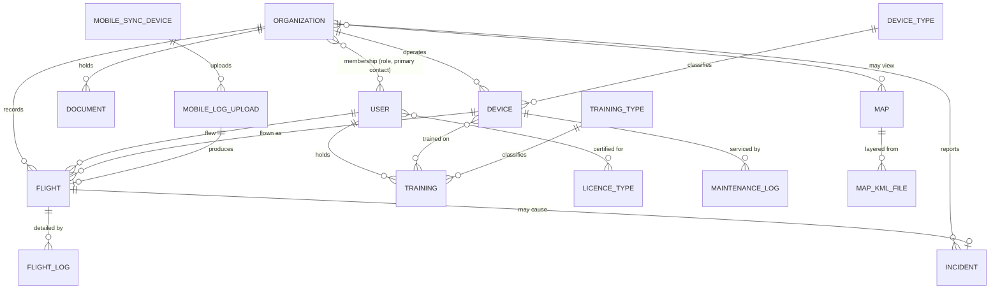

# 03 — Data model

Field names are **observed** where they came from a form binding (`data.x`,
`mountedTableActionsData.0.x`), a request payload key, or a JSON response key. Fields
marked *(inferred)* are deduced from column labels or framework convention and need
confirming against the database.

Types are the logical type. Constraints listed are those enforced client-side; server
rules are stricter and were not visible (see `00-index.md`).

## Entity relationship overview

---

## Organization

The tenant. Everything else hangs off it.

| Field | Type | Constraints | Notes |
|---|---|---|---|
| `id` | int PK | | |
| `name` | string(255) | **required** | |
| `logo_path` | string | PNG/JPG/WebP, ≤2 MB | Field name Observed on the form; stored `organization-logos/{ULID}.ext` |
| `uas_registration_number` | string(255) | | Operator registration, e.g. `SVK…` |
| `specific_permit_number` | string(255) | | SPECIFIC-category operating permit |
| `specific_operation_type` | enum | `VLOS` \| `BVLOS` | |
| `max_allowed_altitude` | decimal | | Metres |
| `insurance_valid_until` | date | | |
| `licence_expiry_warning_days` | int | **required**, 1–730, default 40 | Drives the amber expiry warning on the report |
| *report token* | string(32) hex | unique | Route key **and** operator-report URL. Column name not observed |

Counts shown in the admin table (`Používatelia`, `UAS`) are aggregates, not columns. There
is no `updated_at`: the register offers one as a toggleable column — Observed — but no
modification timestamp was ever seen in a payload, so the rebuild leaves the cell blank
rather than inventing a column to fill it.

### Organisation deletion and the logo in the rebuild — decided

A **decision about the rebuild**, taken on 15 Aug 2026 by the rebuild loop under the owner's
standing autonomy grant and recorded on issue #38. The owner has not reviewed it: settled
enough to build on, open enough to overturn.

**The logo is a path, not bytes.** `logo_path` holds where the file lives; the file lives on
disk. The form field name is Observed, and that it stores a path is *(inferred)* from the
observed `/storage/organization-logos/{ULID}.png` route — a column of bytes would not be
served from one. Keeping the bytes out of the row also keeps the register's own query small.
What serves that path is the section below.

**Deleting an organisation is blocked while dependents exist** — block rather than
soft-delete. The register offers the delete as a bulk action
([04-admin-resources.md](04-admin-resources.md) §OrganizationResource), which defers here
for which way it goes. An organisation owns flights, documents and maintenance history, so
a cascade destroys airworthiness evidence, and a `deleted_at` on a table nothing else
filters buys nothing yet.

The block is the `ON DELETE restrict` on the dependent foreign keys, not a check in a
controller: a second call path can skip a controller and cannot skip the database.
`membership.organization_id` stays `cascade` deliberately — dissolving an organisation
detaches its people and every person survives it, which is *detach is not delete* read from
the other end, and a membership is not evidence of airworthiness. So an organisation whose
only dependents are memberships still deletes.

### Serving a stored file in the rebuild — decided

A **decision about the rebuild**, taken on 16 Aug 2026 by the rebuild loop under the owner's
standing autonomy grant and recorded on issues #56 and #75. The owner has not reviewed it:
settled enough to build on, open enough to overturn. It governs every stored file and not only
the logo above — the organisation logo was the first consumer and the document library the
second, §Document's three workspace buckets joined the library on that same route, and §Map's
KML layers are still to come.

**The bytes stay on disk and the row holds the path**, unchanged from the section above.
Hosting is one small instance with the application and Postgres co-located, so an object
store is a dependency the deployment does not have.

**What backs that disk up is not settled here, and it needs to be.** A single instance's
disk is then the whole durability story for every uploaded file, with the rows and the
bytes backed up separately or not at all. The answer is owed before real operator data
lands, which is the history migration, #14.

**Nothing is served from a static path, ever.** A file is served by an authenticated route
handler that resolves the owning row **first**, inside the tenant transaction, and streams
bytes only if that read returned a row. The handler takes a **row id**; the path is a column
it reads, never an input it trusts — which disposes of path traversal rather than defending
against it. The route sits under the resource that owns the file, because a generic file
route is the shape that invites a handler taking a path.

**One route per resource, and the resource is the table** — corrected 17 Aug 2026, on issue
#75. `/api/documents/{id}/file` serves every bucket of §Document; `/api/general-documents/{id}/file`
was its first form and is gone. The sentence above had been read as *one route per register*,
which would have stood five handlers over one table, and that reading does not follow from it:
what this section forbids is a **request-supplied path**, and a route keyed on a row id of one
table supplies none. Every property asked for above survives — the handler takes an id,
resolves the row inside the tenant transaction, reads the path as a column, and inherits the
row's row-level security. The generic file route this section refuses is one that serves *any*
stored file, which needs a path to say which; `document`, `organization` and `map` each keep
their own.

What the consolidation is for is the count. `nosniff`, the extension allow-list, the storage-root
containment check and `Cache-Control: private` are four guards that a fifth handler carries only
because somebody remembered — and a guard required on six handlers and enforced by nobody will
eventually be on five (#63). The three workspace buckets would have taken the count from two to
five; they took it to two. One table was already the decision §"The global document library in
the rebuild" took so that *four tables would repeat the file-serving integration four times*
could not happen, and four routes over that one table is the same repetition through the other
door.

**The allow-list is then the union of what the buckets accept:** `.pdf`, `.doc`, `.docx`,
`.jpg`, `.jpeg`, `.png` — §Document gives the permits bucket the image types. It stays a
different list from the logo's, and `.webp` is what still separates them: it is the logo's and
no document bucket was ever seen to take one. The two lists must not converge on whichever is
easiest to serve, so a test holds them apart on that extension, where before #75 a `.png` did.

The file inherits the row's row-level security for free: another operator's file is not
refused, it **reads as absent**, because the read that would have found it returned nothing
— the reasoning `findOrganization` already carries for a cross-tenant id. Every other gap
answers identically: no stored path, a path resolving outside the storage root, an extension
nothing serves, no file on the disk. One answer, so none of them confirms a row exists.

This is deliberately *not* the predecessor's shape. [01-tech-stack.md](01-tech-stack.md)
records `/storage/…` symlink paths and ULID-derived filenames, both Observed. A symlinked
`/storage/` is public static serving: no session, no membership check, and row-level security
never consulted, because a static file handler never reaches Postgres. A ULID makes a name
unguessable, and unguessable is not a boundary.

**The content type comes from an extension allow-list** — PNG, JPG and WebP for a logo, per
[04-admin-resources.md](04-admin-resources.md) §OrganizationResource — and an extension not
on it is refused rather than guessed at. It is never derived from anything the request
carries: a request that can choose the content type of the file it fetches can turn a stored
file into script.

That allow-list reads the **name and never the bytes**, so the response also carries
`X-Content-Type-Options: nosniff` — otherwise a file named `.png` holding markup is served
under a content type the browser may sniff past and execute in this origin, with the session
cookie in scope. The header belongs to the pattern, not to the logo: the document route
accepts `.pdf`, `.doc` and `.docx` among its six, where sniffing is livelier still.

**The storage root is configuration**, with no default. An unset value fails the first file
request rather than resolving to the working directory, where every file in the checkout
would become a candidate.

**Public read is an explicit opt-in, never a default.** Two exceptions will exist and both
must be positive flags the handler checks: `document.is_public` (permits only, exposed on the
operator report) and the public `/map/{slug}` routes in
[02-sitemap-routes.md](02-sitemap-routes.md). `document` now exists and carries the flag,
and neither handler built so far has a branch for it — which is the point. What this section
owes both is a handler whose default branch refuses, because one whose default branch serves
is written the wrong way round.

**Deferred to whichever slice builds the write path:** generated storage names, per-bucket
size and content-type validation on upload, and the upload endpoint itself. The only write
path in the rebuild is authentication, so an upload endpoint would have no caller today —
and none of the above depends on how a file arrived, so settling it early mortgages nothing.

### Delete authority in the rebuild — decided

A **decision about the rebuild**, taken on 16 Aug 2026 by the rebuild loop under the owner's
standing autonomy grant and recorded on issue #42. The owner has not reviewed it: settled
enough to build on, open enough to overturn. The predecessor's own delete rules were never
Observed — the crawl was GET-only and performed no writes ([00-index.md](00-index.md)
§"Deliberate gaps") — so nothing here describes it.

Postgres decides `DELETE` by `USING` alone; there is no `WITH CHECK` for it. A policy
written `for: 'all'` with a tenant-or-self `using` and a superadmin-only `withCheck`
therefore narrows inserts and updates and leaves deletion at the `using` predicate. So who
may delete is answered per table rather than left to fall out of that:

| Table | Who may delete | Why |
|---|---|---|
| `organization` | `superadmin` only | Dissolving a tenant is not an operator's own housekeeping, and it is what `withCheck` already says about writing one |
| `person` | `superadmin` only | The register entry a flight history hangs off, and accounts are administered rather than self-served — [09-roles-permissions.md](09-roles-permissions.md) §"Account provisioning" |
| `membership` | `superadmin` only, **for now** | Only a superadmin may create one today, so letting a member delete one is asymmetric in the dangerous direction. Awaiting the people-and-memberships register rather than settled |
| `device_type` | `superadmin` only | The catalogue is deployment-wide, and deleting one entry unsets the type on every airframe of it in the deployment — see §"Catalogue write authority in the rebuild" |
| `training_type` | the owning tenant | A syllabus is the operator's own record, and deleting an entry is the same authority as writing one |
| `device` | the owning tenant | Fleet management is the operator's own job — with the condition below |
| `training` | the owning tenant | Same reasoning as the syllabus entry it points at — see §"Trainings in the rebuild" |
| `training_device` | the owning tenant | Detaching an airframe from a training is not evidence in itself; the training survives it |
| `flight` | the owning tenant | The operator's own record, on the same reasoning — see §"Flights in the rebuild" |
| `flight_log` | the owning tenant | A leg is not evidence apart from its flight, and cascades with it |
| `document` | the owning tenant, and a **superadmin** for the global library | An operator's own bucket is their own record. A document with no organisation belongs to the deployment, and one member must not withdraw it from every other operator — see §"The global document library in the rebuild" |

The superadmin-only rows are **restrictive** delete policies added beside the existing
ones. Permissive policies OR together, so a narrower *permissive* policy would restrict
nothing at all; that distinction is the whole of the fix, and the member half of
`tests/tenancy/delete-authority.test.ts` is what tells the two apart.

`document` is the split row, and its restrictive policy is keyed on the row rather than on
the whole table: only the ones with no organisation need a superadmin, so the tenant-owned
buckets keep the ordinary delete beside it. It is also the first table where an **`UPDATE`**
needs the same treatment, for the reason recorded in its own section.

**This and the dependent block above are independent controls.** A member is refused for
who they are; everybody, superadmin included, is refused while dependents exist. The
organisation whose only dependents are memberships passes the second and now still fails
the first for anyone but a superadmin.

**The airframe condition.** A device carries maintenance readings and the flights flown on
it, so a member could delete an airframe that holds history. Any dependent that does hold it
must reference the device with `ON DELETE restrict`, the way the organisation's dependents
already do. `training_device` was the first to do so: a training that says it covered an
airframe is exactly that history, and deleting the airframe is refused while one says it.
`Flight` has now landed and does the same, so an airframe that flew cannot be deleted out
from under the record. `MaintenanceLog` must follow when it lands.

---

## User

Serves as both login account **and** pilot record — a deliberate design choice worth
preserving or consciously changing.

| Field | Type | Constraints | Notes |
|---|---|---|---|
| `id` | int PK | | |
| `name` | string(255) | **required** | |
| `email` | string(255) | **nullable** | See below |
| `password` | string | nullable | ≥8 chars; the org-person form additionally requires ≥1 letter and ≥1 digit |
| `license_number` | string(255) | | Pilot certificate number |
| `licence_valid_to` | date | | Certificate expiry |
| `phone_number` | string(255) | | |
| `position` | string(255) | | Job title within the organisation |
| `note` | text | | |
| `organization_id` | FK → Organization | nullable | "Bez organizácie" is a real state. Does not survive into the rebuild — see below |

**`email` is nullable and that is load-bearing.** A pilot can exist as a flight-log
subject without ever being able to log in; the UI says so explicitly ("Pre pilotov môžete
nechať prázdne"). The pilot-creation form has a "Vytvoriť prihlasovací účet" toggle that
decides whether credentials are issued at all. Any rebuild that makes email required or
unique-not-null will break the pilot register. Note the consequence: `email` cannot be
the natural key, and uniqueness must be conditional.

### Licence types

Multi-valued: `A1/A3`, `A2`, `STS` (the report also emits combined labels like `A2/STS`,
`STS, A2/STS`). Modelled as a many-to-many or a JSON array — *(inferred)*, not observed.

### Certificates in the rebuild — decided

A **decision about the rebuild**, taken on 16 Aug 2026 by the rebuild loop under the owner's
standing autonomy grant and recorded on issue #39. The owner has not reviewed it: settled
enough to build on, open enough to overturn. It settles the modelling the section above
leaves inferred; that marking describes the *predecessor* and is left standing.

Three columns on `person`, carrying doc 04 §UserResource's *Osvedčenia* section:
`certificate_number`, `certificate_types` and `certificate_valid_until`. The last mirrors
`organization.insurance_valid_until` rather than the predecessor's `licence_valid_to`.

**Certificate, never licence.** [CONTEXT.md](../../CONTEXT.md) §"Certification & training"
names *osvedčenie* the term, and `CLAUDE.md` names licence/certificate a synonym pair not to
reintroduce. `contracts/forms/users.json` holds three of the predecessor's spellings —
`licence_type_ids`, `licence_valid_to`, `license_number`, one of them a typo — and keeps
them: a captured `name` attribute is the wire name of a rendered form, the contract is the
oracle, and the oracle is never edited to agree with us. Nothing a reader sees says
*licence*.

**The types are an enum array, not a table.** `certificate_type` is the closed EASA set
`A1_A3`, `A2`, `STS`, the same tenant-owned-versus-deployment-wide judgement §"Device types
in the rebuild" records, landing on the catalogue side: doc 04 lists thirteen resources and
none of them administers this set, the relationship carries no attributes of its own, and a
pivot table would need a shared-organisation policy of its own — tier-3 surface bought for
nothing.

`certificate_types` is `not null default '{}'`, and **an empty array means no certificate
type is recorded**. That is a gap, and it must never read as a pass — the same rule as an
airframe with no device type.

### Account provisioning in the rebuild — decided

Same decision, same date, same standing — settled enough to build on, open enough to
overturn. It answers what the "Vytvoriť prihlasovací účet" toggle above decided in the
predecessor, which the GET-only capture could not show.

The form's `Heslo` and `Potvrdenie hesla` fields decide whether credentials exist at all:

| Form | Password | Result |
|---|---|---|
| Create | blank | a `person` row and nothing else — no `auth_user`, no `auth_account` |
| Create | given | also an account, through `src/lib/auth` and never by writing the auth tables |
| Edit | blank | unchanged — never "set the password to empty" |
| Edit | given | reset |

**A password with no e-mail is a validation error**, not a null insert: `auth_user.email` is
`not null` and unique while `person.email` is nullable, so credentials with no address are an
account nobody could sign in with. In code: `accountProvisioning()` in
`src/lib/auth/provisioning.ts`, a rule rather than a handler — nothing in the rebuild writes
a resource yet, and deciding this inside the first write path that needs it would be deciding
it in the dark.

### Contact and job-title columns in the rebuild — decided

A **decision about the rebuild**, taken on 17 Aug 2026 by the rebuild loop under the owner's
standing autonomy grant and recorded on issue #73. The owner has not reviewed it: settled
enough to build on, open enough to overturn. Nothing above this line is promoted by it — the
table's `phone_number`, `position` and `note` rows are Observed **of the predecessor** and
stay as they are. What was behind is the rebuild's schema, which grew `person` from the
registers that rendered it and no register had asked for these.

Migration `0012` adds `phone_number` and `position` to `person`, both nullable `text`. They
are what [05-organization-workspace.md](05-organization-workspace.md) §0's `Telefón` and
`Pozícia` columns and §1's `Telefón` render; `/admin/users` collects none of the three, which
is why they were not there already.

**`note` is deliberately left out.** It is Observed on the predecessor and both workspace
forms collect it, but no column in either people tab renders it and no write path fills it —
a column with no reader and no writer is speculative structure. It lands with the surface
that shows it.

**One `position` per person, not per membership**, which is the cost of the choice and is
stated here rather than discovered later. §"Organisation membership (pivot)" below records —
Observed — that the three may live on the pivot or on the user, and the capture could not
distinguish them; `position` is *"Job title within the organisation"*, so a column on
`person` gives one job title across every organisation a person belongs to. That row is not edited
by this decision. Today every person holds one membership, so nothing observes the
difference — the same footing §"Membership in the rebuild" put its own one-organisation
semantics on, and moving a column to the pivot later is cheaper than a policy is.

### Organisation membership (pivot)

Users attach to organisations with membership attributes, so this is a pivot table, not
just `organization_id`:

| Field | Type | Notes |
|---|---|---|
| `organization_role` | enum | Radio-selected. Includes at least `Zodpovedný manažér` (Responsible Manager) |
| `is_primary_contact` | bool | "Hlavná kontaktná osoba" |
| `position`, `phone_number`, `note` | | May live on the pivot or the user — not distinguishable from the UI |

The predecessor carries a tension here: `User.organization_id` exists *and* the org
workspace has both a "Pilots" and an "Organisation people" register with attach/detach
semantics ("Priradiť existujúceho používateľa", "Odobrať z organizácie") — Observed. Which
of the two actually scopes data access was never determinable from outside.

**Evidence gathered on it.** Pilot identity sets were compared across all nine captured
organisations, using `data.pilots[].id` from the operator-report payloads — ids only, since
set membership is the question and identity is not needed to answer it. 100 distinct pilot
ids, and **zero** appearing in more than one organisation. The largest tenant holds 76; two
hold none.

That is **Inferred, not Observed**, and the inference is potentially circular: if the report
query itself scopes by `users.organization_id`, disjoint sets are what it would produce
whether or not the pivot is in use. It shows the operational reality, not the schema's
intent. The capability, meanwhile, is plainly deliberate — both registers can attach an
*existing* user, and the pivot carries its own per-organisation role and primary-contact
flag (doc 09). The pivot is not vestigial; it is simply unused in the current dataset.

### Membership in the rebuild — decided

A **decision about the rebuild**, taken by the owner on 15 Aug 2026. Membership is a
first-class table, `(person, organisation, role, is_primary_contact)`. `organization_id` on
the person does not survive.

Today every person has exactly one membership row, so this gives one-organisation semantics
now at no cost, and multi-organisation later without a redesign. The multi-organisation
product question is deferred rather than answered, which is safe precisely because the
schema supports either.

**Row-level security keys off membership, never off a column on the person.** A
`person.organization_id` would have to be kept in sync with the membership table, and the
two disagreeing is a tenant-isolation bug — exactly the class RLS is here to make
impossible. Primary organisation, needed for the `/` redirect, derives from the
primary-contact flag.

### The shared-organisation read in the rebuild — decided

A **decision about the rebuild**, taken on 16 Aug 2026 by the rebuild loop under the owner's
standing autonomy grant and recorded on issue #39. The owner has not reviewed it: settled
enough to build on, open enough to overturn. Nothing here describes the predecessor — only a
superadmin session was ever observed, so it never showed what one member may read of another
([09-roles-permissions.md](09-roles-permissions.md) §"Observed access behaviour").

A people register needs "the people I share an organisation with", and the obvious way to
write it deadlocks. A policy expression reads another table under *that* table's policies,
so a `person` policy asking about shared memberships reads `membership` under a policy that
admitted only your own rows, and returns nobody but yourself; widening that one to ask which
organisations you belong to makes it read `membership` under itself, which recurses.

**A `SECURITY DEFINER` function breaks both knots at once.**
`app_acting_organizations()` returns the organisations the acting person holds a membership
of, reading `membership` outside row-level security, so nothing asks a policy the question a
policy is answering. It is the only trusted thing added here, so it answers exactly one
question: it never reads the system role, superadmin stays in the policies, and its
`search_path` is pinned empty with `public.membership` written out. It must be owned by a
role row-level security does not apply to — `FORCE ROW LEVEL SECURITY` reaches a plain table
owner, and a function owned by one escapes nothing.

Two policies are then rewritten against it:

| Policy | Reads |
|---|---|
| `membership_tenant_isolation` | every attachment to an organisation the acting person belongs to |
| `person_shared_organization_or_self` | yourself, plus anyone holding a membership of an organisation you belong to |

**The person policy states the organisation predicate itself** rather than leaning on
membership's, which now ands the same condition on. The redundancy is deliberate: the
register's scoping belongs in the policy that scopes it, not inherited from a neighbour a
later change could narrow silently. No behavioural test can reach that — the policy that
would catch it is the one it duplicates — so it is asserted against the catalogue instead.

**This widens reading and nothing else.** `WITH CHECK` on both tables stays `superadmin`
only and both restrictive delete policies are untouched, so a member now sees rows they
still may not touch. That leaves a real gap: *Manage people & memberships* and *Provision or
reset an account* are `accountable_manager` capabilities in the matrix
([09-roles-permissions.md](09-roles-permissions.md) §"Capability matrix") and the database
admits neither. Closing it needs a policy predicate over a *per-membership* role, which no
policy here does yet — a second decision of this size, on its own issue, #48. Until it
lands the people register is read-only for a member, and its chrome offers `Vytvoriť` and
`Upraviť` only to a session the database would admit: `mayManagePeople()` in
`src/lib/auth/capabilities.ts`, beside the matrix it narrows.

The case that decides whether the pair is right is the **person two operators share**. They
are visible to a member of either, and their membership of the *other* operator is not —
otherwise a register leaks the existence of an organisation and its staffing through the one
row that reaches across the boundary.

---

## Device (UAS / airframe)

| Field | Type | Constraints | Notes |
|---|---|---|---|
| `id` | int PK | | |
| `organization_id` | FK | | |
| `serial_number` | string(255) | **required** | The real identity of the airframe |
| `name` | string(255) | | Friendly label |
| `model` | string(255) | | e.g. `MATRICE 4TD` |
| `manufacturer` | string(255) | | e.g. `DJI` |
| `device_type_id` | FK → DeviceType | nullable | "Nepriradený" is common; max VLOS inherits from the type |
| `status` | enum | **required** | `Aktívne` \| `Neaktívne` \| `Údržba` \| `Vyradené` |
| `notes` | text(65535) | | |

Derived/served fields on the report: `max_vlos_meters`, `total_flights`,
`total_flight_hours`, `lifetime_flights_count`, `last_flight_date`.

### Service tracking (derived)

The report computes a service state per airframe from the type's intervals. These are
**calculated, not stored** — reproduce the logic, not the columns:

`service_is_configured`, `service_due` (bool), `service_due_reasons` (array),
`service_interval_cycles`, `service_lifetime_cycles`, `service_baseline_cycles`,
`next_service_at_cycles`, `service_remaining_cycles`, `service_overdue_cycles`,
`service_interval_months`, `service_calendar_baseline_date`, `next_service_date`,
`service_remaining_days`, `service_overdue_days`, `service_warning`.

**Rule (from helper text):** one cycle = one recorded flight. Calendar interval counts
months from the last maintenance entry, or from the first recorded flight if there is
none. When both a cycle interval and a calendar interval are set, **whichever limit is
reached first triggers the warning.** The baseline fields exist so that logging
maintenance resets the count — `service_baseline_cycles` is the cycle count at last
service, and `service_lifetime_cycles` is the all-time total.

**What the captured payloads actually serialise — Observed.** Across 27 captured report
payloads and their 216 airframe rows, five of these keys carry the type `null` and nothing
else: `service_interval_months`, `service_calendar_baseline_date`, `next_service_date`,
`service_remaining_days` and `service_overdue_days`. `max_vlos_meters` is served as a
**string**, not a number. `service_due_reasons` is an array in every row, non-empty in six.

*Why* the calendar keys are null is *(inferred)*: a null in a payload does not distinguish
"no captured organisation configured a calendar interval" from "the report never populates
those keys at all", and no captured record separates the two. Under either reading the
calendar half of the dual interval has **no parity subject** — the rule above is unaffected
and stays Observed on the helper text in `04-admin-resources.md`, but a test of
whichever-comes-first tests the rebuild's own implementation of that rule, never agreement
with the predecessor. Name it so; a green test otherwise implies coverage that does not
exist.

---

## DeviceType

| Field | Type | Constraints | Notes |
|---|---|---|---|
| `name` | string(255) | **required** | |
| `max_vlos` | decimal(step 0.01) | | Metres; inherited by devices of this type |
| `service_interval` | int | ≥0 | Cycles (= flights) between services |
| `service_interval_months` | int | ≥1 | Calendar months between services |
| `battery_service_interval` | int | ≥0 | Battery cycles/flights |
| `maintenance_instructions` | text(65535) | | Shown to whoever performs the service |

Neither the create nor the edit form carries an organisation field, and `/admin/device-types`
has no organisation segment — Observed, from a GET-only capture. That the table itself has no
`organization_id` is *(inferred)*: a column absent from a form is not a column absent from a
table, and no write path was ever exercised.

### Device types in the rebuild — decided

A **decision about the rebuild**, taken by the owner on 15 Aug 2026. The device-type
catalogue is deployment-wide and maintained by `superadmin`, which is where
`09-roles-permissions.md` Axis A already lists it among the system registers.

So a device type is not tenant-owned and carries no tenant scoping. The tenant-scoped entity
in this chain is **Device**, which holds `organization_id` and inherits its VLOS limit and
service intervals from a type — which is also why the missing-device-type gap is a statement
about an airframe rather than about the catalogue.

### Catalogue write authority in the rebuild — decided

A **decision about the rebuild**, taken on 17 Aug 2026 by the rebuild loop under the owner's
standing autonomy grant and recorded on issue #65. The owner has not reviewed it: settled
enough to build on, open enough to overturn. Nothing here describes the predecessor, whose
own write rules were never Observed for the reason §"Delete authority in the rebuild" gives.

**"Maintained by `superadmin`" above was a sentence in this document and nothing in the
database.** `device_type` was the only table in the schema with no row-level security at all
— the right answer to *which tenant scopes it*, since none can, and no answer at all to *who
may write it* while the schema-wide `GRANT` hands every session the three write verbs. What
that left a member holding: `device.device_type_id` is `ON DELETE set null`, so deleting one
catalogue row unsets the type on every airframe of that type across every operator, and an
airframe with no device type has no VLOS limit and no service interval — so it can never
register a violation or a service warning, and the loss reads as a clean compliance record.
Editing `max_vlos` is quieter and re-judges every flight of every operator flying the type.

So the table carries policies, and **none of them names an organisation**, because it has
none to name:

| | `superadmin` | any other session | a connection with no acting person |
|---|---|---|---|
| `USING` | ✅ | ✅ | ❌ |
| `WITH CHECK` | ✅ | ❌ | ❌ |

plus a **restrictive `FOR DELETE`** keyed on `superadmin`, because `USING` alone decides
`DELETE` — #42 again, and the row the delete-authority table above now carries.
`tests/tenancy/catalogue-write-authority.test.ts` holds all three verbs up, and
`tests/tenancy/airframe-isolation.test.ts` still holds the deployment-wide half —
**rewritten** by this slice rather than removed, because what it asserted was the *absence*
of row-level security as the mechanism for not being tenant-scoped.

**No restrictive `UPDATE` policy, unlike the global document library, and that is a
difference rather than an omission.** `UPDATE` is decided by `USING` **and** `WITH CHECK`: a
member passes the read and then fails the flat check, because no value of a catalogue row
makes them a superadmin. The library needed one because there was such a value — setting
`organization_id` to their own is an edit its check admits. One policy per command and never
a restrictive `for: 'all'`, for the reason §"The global document library in the rebuild"
gives.

**The shape every later deployment-wide register inherits** — `map` is the next one. Being
deployment-wide decides the *read* and decides nothing about the *write*, and a table with no
policy has no write authority rather than a strict one.

---

## MaintenanceLog

Created from the operator report, against a device.

| Field | Type | Constraints |
|---|---|---|
| `device_id` | FK → Device | |
| `maintenance_date` | date | **required** |
| `total_flight_hours` | string | **required** — accepts `h:mm` or decimal hours |
| `total_flights` | int | |
| `maintenance_performed_by` | string | |
| `fault_and_maintenance_description` | text | |
| `preflight_check_performed_by` | string | |

`total_flight_hours` and `total_flights` are captured as **stated readings at time of
service**, not recomputed. That is the correct behaviour for a maintenance record — it
records what the technician certified — so keep it.

---

## Flight

| Field | Type | Notes |
|---|---|---|
| `id` | int PK | |
| `organization_id` | FK | |
| `pilot_id` | FK → User, **nullable** | Unassigned flights are normal and expected |
| `device_id` | FK → Device, **nullable** | Likewise |
| `file_name` | string | Source log filename; also the display name |
| `entry_mode` | enum | Which of the three import paths created it (doc 07) — the rebuild's enum carries four, see §"Flights in the rebuild" |
| `total_flight_time_seconds` | int | Entered as `h:mm` or decimal hours, stored as seconds |
| `max_altitude_meters` | decimal | |
| `max_distance_meters` | decimal | Maximum distance from the pilot — the figure the VLOS check is judged on |
| `total_distance_meters` | decimal | Track length, which is a different quantity |
| `parsing_status` | enum | e.g. `Spracované`; `parsing_errors` carries the message |
| `imported_by` | FK → User | |
| `created_at` | datetime | "Importované" |

`max_distance_meters` was **absent from this table until 16 Aug 2026**, and it is a gap in
the crawl rather than a field the predecessor lacks. The crawl was GET-only, so no payload
carrying it was ever fetched here; three other Observed records name it. Doc 07 §"Mode 3"
collects `manual_max_distance_meters` *and* `manual_total_distance_meters` and states the
two are distinct. The derivation below compares "the flight's max distance", a column this
table did not contain. And [06-org-report.md](06-org-report.md) lists `max_distance` beside
`max_altitude` in the captured `flights[]` payload, extracted to
`contracts/report-schema.json` as `data.flights[].max_distance` — a captured JSON body
rather than prose. The row above is that gap closed, not a new observation.

Derived on the report: `has_vlos_violation` (bool) — compares the flight's max distance
against the aircraft's max VLOS. `flight_date`, `flight_date_display`, `flight_date_sort`
are presentation variants of the same instant.

**A flight can exist with neither pilot nor aircraft assigned.** The report surfaces these
with inline "Priradiť" buttons, and there is a whole admin queue for the sync-imported
case. Model the assignment as a separate, later step — not a creation-time requirement.

## FlightLog

Per-segment detail rows under a flight, from the parsed log.

| Field | Type |
|---|---|
| `flight_id` | FK |
| start / end datetime | datetime |
| duration | interval (`hh:mm:ss`) |
| distance, max altitude | decimal |
| aircraft | string |

One imported file can yield several flight-log rows (the admin table has a "Záznamy
logov" count per flight), so **Flight : FlightLog is 1:N** — a flight is the unit of
record, a flight log is a leg or sampling window within it.

---

## Training / TrainingType

**Training**

| Field | Type | Constraints | Notes |
|---|---|---|---|
| `name` | string(255) | **required** | |
| `training_type_id` | FK | | |
| `user_id` | FK → User | **required** | The pilot |
| `date_start` | date | | When it took place |
| `date_end` | date | nullable | Expiry; empty = "Bez expirácie" |
| devices | M:N → Device | | Training can be airframe-specific |

**TrainingType**: `name` (required), `code` (required, unique), `description`.
Observed instances include `A1/A3`, `Prevádzkový výcvik` (operational training), `ERP`
(emergency response procedures). The uniqueness is Observed from the form; *unique against
what* was not — the crawl reached a single tenant, in which a deployment-wide code and a
per-organisation one look identical.

### Training types in the rebuild — decided

A **decision about the rebuild**, taken on 15 Aug 2026 by the rebuild loop under the owner's
standing autonomy grant and recorded on issue #37. The owner has not reviewed it: settled
enough to build on, open enough to overturn. A training type is **tenant-owned**: the table
carries `organization_id`, row-level security scopes it in the shape of the airframe's
policy, and `code` is unique **per organisation** — two operators may both hold a code `A1`.

A syllabus entry is an operator's own record of what it trains its pilots on, not a
deployment-wide fact like the device-type catalogue above. So the register sits on the
organisation surface rather than among the system registers, and the capability that
governs it is the existing *Manage trainings* (`09-roles-permissions.md`).

Delete is a **hard delete**, unlike the organisation register: a training type with no
trainings attached carries no airworthiness evidence. Training rows now exist and can point
at one, and the revisit that was deferred here landed with them: the hard delete stands, and
it is **blocked while a training references the entry** by the `restrict` in the section
below.

### Trainings in the rebuild — decided

A **decision about the rebuild**, taken on 16 Aug 2026 by the rebuild loop under the owner's
standing autonomy grant and recorded on issue #51. The owner has not reviewed it: settled
enough to build on, open enough to overturn. Nothing here describes the predecessor; the
entity table above is what was Observed, and it stays standing.

`training` is **tenant-owned** on the shape the section above established — `organization_id`
not null, `restrict`, its own tenant-isolation policy. A training record is competency
evidence, so a tenant delete must be a deliberate act against an emptied organisation.

**The names that change**, and nothing else does:

| Column | From the contract | Why the name changed |
|---|---|---|
| `held_on` | `date_start` | there is no end of a training, so `date_start` names a range that does not exist. The entity table above reads it *"when it took place"* |
| `valid_until` | `date_end` | mirrors `organization.insurance_valid_until` and `person.certificate_valid_until`. **Blank means never expires**, per [04-admin-resources.md](04-admin-resources.md) §TrainingResource — never *expired* |

The wire names stay the contract's in `src/lib/trainings/fields.ts`, the way §"Certificates
in the rebuild" keeps `licence_type_ids`: a captured `name` attribute is the wire name of a
rendered form, and `contracts/` is never edited to agree with us.

**The foreign keys carry the tenant, so a cross-tenant row is impossible.** Not merely
scoped by policy — rejected by the schema. `training_type` and `device` are both
tenant-owned, so a plain reference to either would let a training point at another operator's
syllabus entry or airframe, and no policy on `training` would notice, because the row's own
`organization_id` would be perfectly correct. So both referenced tables carry a unique
constraint on `(id, organization_id)` — redundant beside each primary key, and existing to be
referenced — and `training` carries `organization_id` into a composite foreign key against
each. `MATCH SIMPLE` is the default and is wanted: `training_type_id` is nullable, and a null
there leaves the constraint unenforced rather than failing.

`pilot_id` gets none of that, because `person` carries no organisation column and never will
(§"The shared-organisation read in the rebuild"). What keeps a cross-tenant pilot out is
`person_shared_organization_or_self` at read time.

**The pivot.** `training_device (training_id, device_id, organization_id)`, unique on
`(training_id, device_id)`, with a tenant-isolation policy shaped like its siblings and
composite foreign keys into both `training (id, organization_id)` and
`device (id, organization_id)`, so **both ends are provably the same tenant as the row**. It
carries `organization_id` rather than reaching `training` through a policy subquery: a
subquery would be the first policy in the schema depending on a *neighbour's* policy to be
correct, which is the coupling that breaks silently when one of the two is narrowed alone.
The composite foreign keys make the denormalisation unable to drift, and that is what buys
the directness. It needs no foreign key to `organization` of its own — the reference into
`training` already forces the column to be a real training's tenant.

**`WITH CHECK` is tenant-scoped, not superadmin**, on both new tables — unlike `person` and
`membership`, and like `training_type`. A training is the operator's own record, *Manage
trainings* is an `accountable_manager` and `operations` capability
([09-roles-permissions.md](09-roles-permissions.md) §"Capability matrix"), and deleting one
is the same authority as writing one, so neither table carries a restrictive delete policy.

**`Zariadenia` renders through the pivot** as an aggregate, the way `Organizácia` and `Roly`
do over membership rows. It is only safe because `training_device_tenant_isolation` and
`device_tenant_isolation` key off the same `app_acting_organizations()` set: a readable pivot
row whose airframe is not readable would understate what a training covered with nothing
failing. Narrowing either policy without the other is what breaks it. There is no
organisation filter anywhere in the read — the policy scopes it, not a `WHERE` clause.

### Flights in the rebuild — decided

A **decision about the rebuild**, taken on 16 Aug 2026 by the rebuild loop under the owner's
standing autonomy grant and recorded on issue #59. The owner has not reviewed it: settled
enough to build on, open enough to overturn. Nothing here describes the predecessor; the
§Flight and §FlightLog tables above are what was Observed, and they stay standing.

`flight` is **tenant-owned** on the shape the two sections above established —
`organization_id` not null, `restrict`, its own tenant-isolation policy, `WITH CHECK`
tenant-scoped on both halves and no restrictive delete policy. A flight is the airworthiness
record, so a tenant delete must be a deliberate act against an emptied organisation.

**`pilot_id` and `device_id` are both nullable and stay that way.** A flight with neither is
normal: automated ingest cannot know who was flying, assignment is a later step, and the
register never hides an unassigned flight — it is the row most needing attention.

**`device_id` carries `organization_id` into a composite foreign key** against
`device (id, organization_id)`, exactly as `training.training_type_id` does. A plain
reference would let a flight name another operator's airframe with the row's own
`organization_id` perfectly correct and no policy noticing. `MATCH SIMPLE` is the default and
is wanted: the column is nullable, and a null leaves the constraint unenforced, which is what
keeps an unassigned flight writable. `pilot_id` and `imported_by` get none of that, because
`person` carries no organisation column (§"The shared-organisation read in the rebuild");
what keeps a cross-tenant pilot out is `person_shared_organization_or_self` at read time.

**It restricts what it depends on, in three directions**, and each keeps a promise §"Delete
authority in the rebuild" made: on `device`, so an airframe that flew cannot be deleted out
from under the record; on `pilot_id` and on `imported_by`, so neither the person who flew nor
the person who filed it can be.

**`flight_log` carries its own `organization_id`** and takes a composite foreign key into
`flight (id, organization_id)`, cascading from the flight, rather than reaching it through a
policy subquery — the reasoning `training_device` records above, and now an established
pattern. A leg is not evidence apart from the flight it details, which is why this one
cascades where the airframe restricts.

**The enum members are the rebuild's own decision, not a recovered fact.** §Flight above
gives one `parsing_status` value by example, and doc 07's four-valued list belongs to
`MobileLogUpload`, a different entity. So `parsing_status` is `processed | failed`, minimal
on purpose, and a pending state joins it when the parsers land. A **null status is the
manual-entry case** — nothing was parsed, and inventing a state to fill the cell would report
an outcome that never happened. `entry_mode` carries **four** values and not doc 07's three:
the `upload_mode` discriminator has three, but a controller sync does not go through that
endpoint and still produces a flight, so three would leave a synced flight with no entry mode
to carry. The enum describes the data model rather than what the write path can reach, which
today is none of them.

**A failed parse is a row, and the register shows it.** `parsing_status` and `parsing_errors`
exist from the first migration though nothing parses yet, because the register has to be
built around the fact that they can be set. Nothing in the read filters on them.

**The stated duration is the record.** Doc 07 leaves open which wins when an explicit
duration and a start/end pair disagree; the duration does. This is the maintenance rule read
across — a technician's readings are stated, not computed — and flight time drives cycles and
service intervals, so the figure a pilot entered is the record. Start and end are context and
are never a source it is re-derived from. Where a duration is absent and a start/end pair is
present it is derived **once, at entry, and stored**, which is the write path's job. Stored
as `total_flight_time_seconds`, and rendered `h:mm`.

---

## Document

One table serving four buckets, distinguished by category and by whether
`organization_id` is set — *(inferred, but strongly indicated)*: the admin resource is
`OrganizationDocumentResource` yet is exposed as "general documents", while the org
workspace has three separate document registers using the same field shape.

| Field | Type | Constraints |
|---|---|---|
| `organization_id` | FK, nullable | null ⇒ global/template document |
| `name` | string(255) | required (except permits, which take the filename) |
| `file_path` | string | required |
| `note` | text | |
| `category` | enum | |
| `valid_until` | date | Expiry tracking |
| `is_public` | bool | Permits only — exposes on the operator report |
| `uploaded_by` | FK → User | |
| `size` | int | Displayed human-readable |

Buckets: **Prevádzková dokumentácia** (operations manuals), **Formuláre** (blank forms),
**Letové povolenia** (flight permits — the only bucket with `is_public`), and the global
document library.

Permits accept `.pdf,.jpg,.jpeg,.png,.doc,.docx`; incident files additionally allow
`.docx` up to 50 MB.

The column is `file_path` and not `file`, corrected 17 Aug 2026. The name is **Observed**:
`contracts/forms/general-documents.json` captures this register's create and edit pages and
gives exactly three bindings — `data.file_path`, `data.name`, `data.note`. `file` was read
off the field's label; the oracle names the field. That it holds a path and not bytes is
*(inferred)*, from `organization.logo_path`'s shape read across — the same footing that claim
had before the observed `/storage/…` route settled it there.

The rest of the table stands. §Incident's `file` and §Map's were read off their labels the
same way and are **not** corrected here, because no captured form covers either — what
changed this row is an oracle, not a rule about labels.

### The global document library in the rebuild — decided

A **decision about the rebuild**, taken on 17 Aug 2026 by the rebuild loop under the owner's
standing autonomy grant and recorded on issue #61. The owner has not reviewed it: settled
enough to build on, open enough to overturn. Nothing here describes the predecessor; the
table above is what was Observed, and its *(inferred, but strongly indicated)* marking stays
standing — this section **follows** that inference rather than resolving it.

**One table, `organization_id` nullable, and null is the global library.** One and not four,
because the four buckets share a field shape, because #14's history migration lands into a
shape that mirrors the source, and because four tables would repeat the file-serving
integration four times. `restrict` on the organisation, like the airframe and the flight: an
operator's compliance pack is evidence, and a tenant delete must not sweep it.

**A `CHECK` ties the two discriminators together:** `category = 'general'` **if and only if**
`organization_id is null`. Stated as an equality, so it fails in both directions — a one-way
constraint would leave an ownerless permit that no register lists and no policy scopes. This
is the instinct the composite foreign keys above record: the invariant belongs where no later
writer can forget it, not in a policy that has to remember it.

**The policy is asymmetric, and it is the only one in the schema that is.** `USING` carries a
null branch and `WITH CHECK` does not:

| | `superadmin` | `organization_id is null` | `organization_id in (…)` |
|---|---|---|---|
| `USING` | ✅ | ✅, with an acting person | ✅ |
| `WITH CHECK` | ✅ | ❌ | ✅ |

The null branch on the read is what makes the library readable by every session. The same
branch on the write would let any member publish a document into every operator's library in
the deployment; a member writing a null fails the check because `null in (…)` is null and not
true. **Equality here is the bug**, which is the opposite of `training`, `flight` and
`device`, where equality is the correct answer — so an implementer copying one of those
inherits the hole. The read branch also asks for an acting person, so a connection with no
tenant context still reads nothing at all: *readable by every session* is the claim, and a
connection that is nobody is not a session.

**Two restrictive policies beside it, because `USING` alone decides `UPDATE` and `DELETE`.**
Deleting a global document is #42 exactly — the null branch makes the row visible to a
member's `DELETE` and no `WITH CHECK` exists to stop it, so the fix is the one #44 already
established. Updating one is the same hole with the loot attached: the only edit the check
would admit on a global row is a member setting `organization_id` to their own, which
withdraws the document from every other operator's library into theirs. Both are refused by
restrictive policies keyed on `organization_id is not null`, which **and** with the permissive
one and so narrow nothing the tenant-owned buckets rely on. One policy per command and not
one `for: 'all'`: a restrictive policy covering `SELECT` would take the library away from the
sessions it exists for.

**`category` is the bucket, never a field.** A document takes the category of the register it
was added through, which is why no captured form collects one and why the oracle's three
fields have no room for it. That answers half of what doc 04 called *worth resolving*.
`valid_until` is the other half and stays a real gap: the column exists, the register lists
it, and no captured form collects it. It is nullable and **renders as a gap, never as an
expiry that passed** — and deliberately not as `training.valid_until`'s *Bez expirácie*, which
is an Observed predecessor string about a different entity. Whether a later form collects it
is the write path's question.

**`is_public` exists as a column and nothing reads it.** It is the permits bucket's, and the
handler §"Serving a stored file in the rebuild" describes has no branch for it — a public
read stays an explicit opt-in that the slice building permits has to add.

**Nothing here uploads.** #56 deferred generated storage names, per-bucket upload validation
and the upload endpoint itself to the write path, which still does not exist.

---

## Incident

| Field | Type | Constraints |
|---|---|---|
| `organization_id` | FK | |
| `title` | string(255) | **required** |
| `description` | text | **required** |
| `incident_date` | date | **required** |
| `flight_id` | FK → Flight | nullable — optional link to the flight |
| `injuries` | bool | "Došlo k zraneniu osôb?" |
| `notes` | text | |
| `file` | file | ≤50 MB |

---

## Map / MapKmlFile

**Map**: `name` (required), `slug` (required, unique — used in `/map/{slug}`),
`allow_dark_basemap` (bool), and a M:N link to organisations controlling visibility.

**MapKmlFile**

| Field | Type | Notes |
|---|---|---|
| `map_id` | FK | |
| `file` | file | `.kml`, `.kmz`, `.xml`, ≤10 MB; KMZ auto-extracted |
| `display_name` | string(255) | Legend label |
| `default_title` / `default_description` | string / text | Fallback placemark copy |
| `layer_type` | enum | See below |
| `priority` | int ≥0 | Higher = drawn on top |
| `is_active` | bool | Toggled via "Skryť z mapy" |
| `is_not_geozone` | bool | Renders as supplementary info rather than a zone |
| `default_when_no_geozone` | bool | Shown only when the clicked point is in no geozone |

`layer_type` (observed, colour-coded): *no type (grey)*, `NO FLY + 3.7 km` (red),
`5 km ring` (light orange), `LZR` (ochre), `CTR` (light blue), `ATZ` (yellow),
`CHKO` (green — protected landscape area).

### Maps in the rebuild — decided

A **decision about the rebuild**, taken on 17 Aug 2026 by the rebuild loop under the owner's
standing autonomy grant and recorded on issue #67. The owner has not reviewed it: settled
enough to build on, open enough to overturn. Everything above this line is what was Observed;
the table shape below — a pivot table, a unique `slug`, the cascades and the enum's
nullability — is the rebuild's own and promotes nothing.

**A map belongs to no operator.** It is *assigned* to them, so `map` carries no
`organization_id` and takes the write authority §"Catalogue write authority in the rebuild"
decided rather than the tenant-scoped template every register since #51 has followed: a
permissive `FOR ALL` whose `USING` asks only for a resolved acting person, a flat `superadmin`
`WITH CHECK`, and a restrictive `FOR DELETE`. No restrictive `UPDATE` beside it, for the
reason that section gives — `UPDATE` is decided by `USING` **and** `WITH CHECK`, so a member
passes the read and then fails the check, because no value of a map row makes them a
superadmin. Stated here too, because its absence otherwise reads as an oversight.

`slug` is unique deployment-wide: it is the whole address of `/map/{slug}`.

**`map_organization` is the assignment, and it reads like `membership`.** It carries an
organisation, so it is the one table of the three that is tenant-scoped — `USING` is
`superadmin` or `organization_id in (…)`, `WITH CHECK` is a flat `superadmin`, and a
restrictive `FOR DELETE` closes the verb `USING` alone decides. Without that last one the
tenant-scoped read lets a member unassign their own organisation from a map. What the scoping
protects is not the map, which every session reads: it is **which other operators hold it**.

**No composite foreign keys here, and that is decided rather than missed.** Every tenant-owned
slice since #51 carried `organization_id` into a composite key so a row could not name another
operator's record. `map` has no `organization_id` to carry, so both references are plain. Both
cascade — an assignment is not evidence, which is `membership.organization_id`'s reasoning read
from the other end — and detach is still not delete: removing the row removes the assignment
and leaves the map and the operator standing.

**`map_kml_file` follows its map**: deployment-wide, the same policy pair, and `ON DELETE
cascade` on `flight_log`'s reasoning — a layer is not evidence apart from the map it details.
Two judgement calls the field table above does not settle. `layer_type` is **nullable** over
six enum members, because the seventh entry is *no type (grey)*, which is the absence of a
classification and not a value of one — the same shape as an airframe with no device type; and
the members take identifier-safe codes with the label resolving through the message catalogue,
following `certificate_type`'s `A1_A3`. The colour is **not** a column: it is bound to the
type, for the reason [08-maps.md](08-maps.md) §"Layer types" gives. The file column is
`file_path`, not the table's `file`, matching `document.file_path` — the bytes are on disk
and the column says where.

**The assignment is not an access control, and nothing in the rebuild may imply it is.**
[08-maps.md](08-maps.md) says it outright: it controls *which tenants see a map in their
report*, never who may reach the URL, and the captured `/map/{slug}` routes serve anonymously
across every captured map. A tenant-scoped policy sitting beside a deployment-wide map invites
the opposite conclusion, which is why it is written down here. **Whether those routes should
stay public is doc 08's open question and this decision does not close it.**

**Nothing here serves a layer or renders one.** The viewer, the public routes, `Duplikovať`
and the KML relation manager are each their own feature; what exists is the register at
`/admin/maps` and the schema under it.

---

## Mobile sync entities

**MobileSyncDevice** — a registered ground controller.

`identifier`, `device_name`, `model` (e.g. `DJI RC Plus`), `organization_id`,
`last_user_id`, `last_sync_status`, `last_sync_at`, `last_seen_at`, `last_remote_addr`,
`app_version`, `is_blocked`, `blocked_attempts`.

`last_sync_status` enum: `Prebieha` (in progress), `Úspech`, `Čiastočný` (partial),
`Chyba`, `Blokované`, `Vo fronte` (queued), `Duplicitné`.

**MobileLogUpload** — one row per file a controller pushed.

`synced_at`, `file`, `source_path`, `stored_path`, `status`, `user_id`,
`organization_id`, `mobile_sync_device_id`, `device_model`, `size`, `flight_id`
(nullable — set once parsed), `error`.

`status` enum: `Uploaded`, `Duplicate`, `Parse failed`, `Upload failed`.

**EmailLog** — outbound mail audit: `sent_at`, `recipient`, `organization_id`, `subject`,
`category` (`Mesačný prehľad` \| `Systémový e-mail`), `status` (`Odoslané` \| `Zlyhalo` \|
`Odosiela sa`), `mailer`, `message_id`, `error_message`.

The `Mesačný prehľad` category confirms a **scheduled monthly report e-mail** exists.
Its trigger, recipients and template were not observed — worth recovering, since it is
a background job the UI does not reveal.
